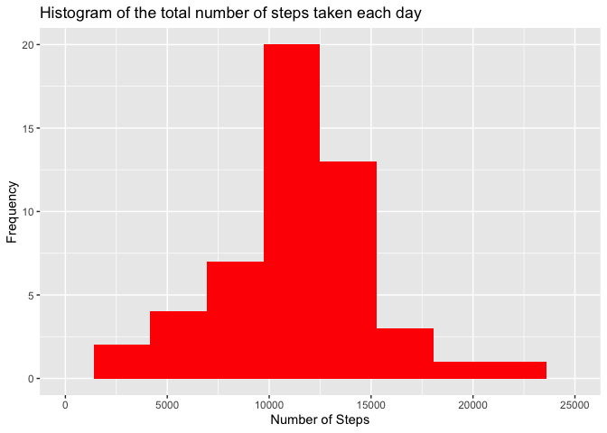
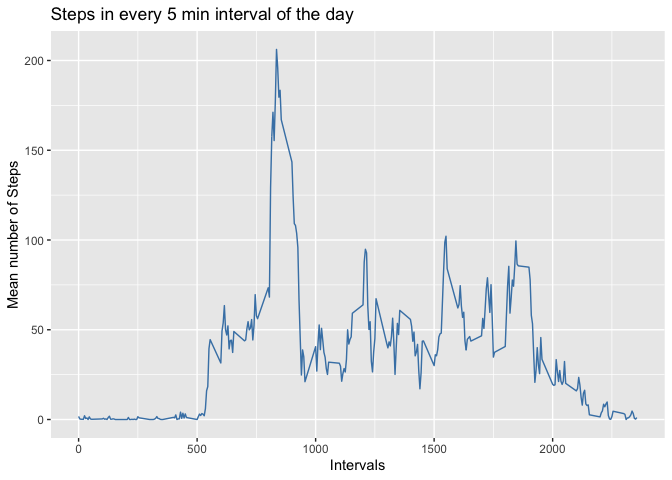
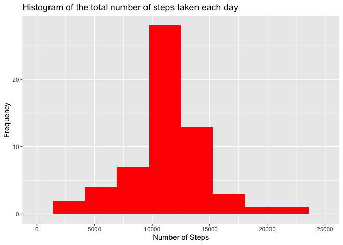
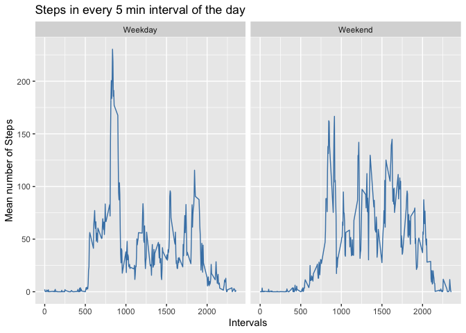

## Loading and preprocessing the data
* Downloading files


```r
zipUrl <- "https://d396qusza40orc.cloudfront.net/repdata%2Fdata%2Factivity.zip"
zipFile <- "repdata_data_activity.zip"

if (!file.exists(zipFile)) {
  download.file(zipUrl, zipFile, mode = "wb")
}

# unzip zip file containing data if data directory doesn't already exist
dataPath <- "repdata_data_activity"
if (!file.exists(dataPath)) {
  unzip(zipFile)
}
```

* Reads activity csv file and assigns it to variable data frame called data


```r
data <- read.table("activity.csv", header = TRUE, sep = ",")

# Converts date variable into a Date object with lubridate package
library(lubridate)
ymd(data$date)
```


## What is mean total number of steps taken per day?
* First, create the total number of steps in each day

```r
      histdata <- with(data,aggregate(steps, by = list(date), sum))
      histdata <- histdata[complete.cases(histdata),]
```

* Plotting histogram of the total number of steps taken each day
    
    ```r
      library(ggplot2)
      ggplot(histdata, aes(x=x)) + 
      geom_histogram(bins = 10,fill = "red")+
      xlim(0,25000)+
      labs(title = "Histogram of the total number of steps taken each day")+
      labs(x = "Number of Steps", y = "Frequency")
    ```
    
    <!-- -->

* Mean and Median number of steps per day

```r
      library(dplyr)
      histdata %>% 
      summarise(Daily_Mean = mean(x), Daily_Median = median(x))
```

```
##   Daily_Mean Daily_Median
## 1   10766.19        10765
```


## What is the average daily activity pattern?
* Building time series Mean numbers of steps in each 5 min interval

```r
      timeseries <- data %>%
                    group_by(interval) %>%
                    summarise(MeanSteps = mean(steps, na.rm = TRUE))
```
      
      
* Plotting time series of the mean number of steps taken in each interval each day

```r
      g <-  ggplot(timeseries, aes(interval,MeanSteps)) + 
            geom_line(color = "steelblue")+
            labs(title = "Steps in every 5 min interval of the day")+
            labs(x = "Intervals", y = "Mean number of Steps")
      plot(g)
```

<!-- -->


*The 5-minute interval that, on average, contains the maximum number of steps  

```r
timeseries[which.max(timeseries$MeanSteps),1]
```

```
## # A tibble: 1 x 1
##   interval
##      <int>
## 1      835
```


## Imputing missing values
   

```r
      #Number of observations with missing data
      x <- sum(is.na(data$steps))
      print(x)
      
      imputedata <- data #creates a new data frame with copy of raw data
      
      for (i in seq_along(imputedata$steps)) { #in every observation of copy 
        
            if (is.na(imputedata$steps[i])){ #If number of steps is NA
            imputedata$steps[i] <- timeseries$MeanSteps[which(timeseries$interval == imputedata$interval[i])] #Get mean number of steps  for the respective interval (previously calculated on step 4)
            }
      }
```

* Processing observations with the total number of steps taken each day

```r
histdata <- with(imputedata,aggregate(steps, by = list(date), sum))
```
      
* Plotting histogram of the total number of steps taken each day after imptation

```r
        ggplot(histdata, aes(x=x)) + 
        geom_histogram(bins = 10,fill = "red")+
        xlim(0,25000)+
        labs(title = "Histogram of the total number of steps taken each day")+
        labs(x = "Number of Steps", y = "Frequency")
```

<!-- -->

## Are there differences in activity patterns between weekdays and weekends?

* Processing mean number of steps on Week vs. Weekend

```r
        # Identifying week vs. weekend
        imputedata <- imputedata %>%
        mutate(dayType= ifelse(weekdays(ymd(date)) %in% c("Saturday","Sunday"), "Weekend", "Weekday"))
        
        # Calculating mean number of steps on Week vs. Weekend
        timeseries <- imputedata %>%
                    group_by(dayType,interval) %>%
                    summarise(MeanSteps = mean(steps, na.rm = TRUE))
```
      
* Plotting panel with number of steps on Week vs. Weekend     

```r
      ggplot(timeseries, aes(interval,MeanSteps)) + 
            geom_line(color = "steelblue")+
            facet_grid(. ~ dayType)+
            labs(title = "Steps in every 5 min interval of the day")+
            labs(x = "Intervals", y = "Mean number of Steps")
```

<!-- -->
